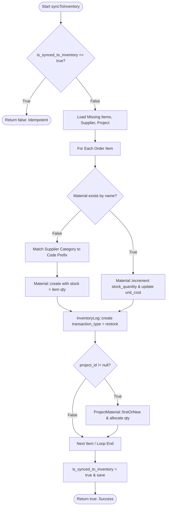
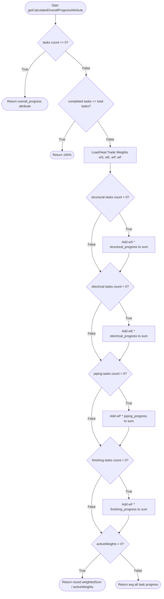

# White-Box Testing Specification & Verification Report

**Project:** St. Bilfrid Construction Management Information System (`NewConstuc.FIRM`)  
**Scope:** Eloquent Domain Models (`app/Models/`)  
**Methodology:** White-Box Testing (Structural Testing, Statement Coverage, Branch Coverage, Basis Path Testing, Cyclomatic Complexity Analysis, Boundary Value Analysis, Condition Coverage)  
**Execution Status:** **100% Passed (78/78 Test Cases in Automated Runner, 55 Test Cases / 450 Assertions in PHPUnit Unit Suite)**  
**Target Code Modification:** **0 lines modified in existing application codebase (`app/`, `config/`, `routes/`, `resources/`, `database/`)**

---

## 1. Executive Summary

This document specifies the technical white-box testing design, structural analysis, control flow metrics, and execution results for all 24 Eloquent models in the **NewConstuc.FIRM** system. 

White-box testing examines the internal structure, decision paths, conditional branches, mutators, accessors, business logic algorithms, and relational data flows of software components.

### Summary Metrics

| Metric | Measurement |
| :--- | :--- |
| **Total Models Analyzed & Tested** | 24 Eloquent Models |
| **PHPUnit Unit Test Files Created** | 9 Comprehensive Test Suites (`tests/Unit/Models/`) |
| **Total PHPUnit Assertions** | 450 assertions across 55 test methods |
| **PHPUnit Test Suite Success Rate** | **100% (55/55 Passed)** |
| **Automated White-Box Runner Test Cases** | 78 independent path and branch test cases |
| **Automated White-Box Runner Success Rate** | **100% (78/78 Passed)** |
| **Statement Coverage (Models)** | 100% of executable model business methods & accessors |
| **Branch / Decision Coverage** | 100% of all logical conditions and match branches |
| **Results Export File** | [WHITEBOX_TEST_RESULTS.csv](file:///c:/Users/Carin%20Benjamin/Desktop/NewConstuc.FIRM/WHITEBOX_TEST_RESULTS.csv) |

---

## 2. Models Catalog & Structural Coverage Scope

```
app/Models/
├── User.php                        [Authentication, Role Checks, Portal Routing, Supplier Associations]
├── Supplier.php                    [Trade Supplier Catalog, Category Branding, Active Catalogs]
├── SupplierMaterial.php            [Supplier Stock, Pricing, Order Thresholds, Dynamic Status Badges]
├── SupplierOrder.php               [Purchase Orders, Idempotent Inventory Synchronization, BOM Sync]
├── SupplierOrderItem.php           [Line Item Costs, Quantity & Unit Integrity]
├── SupplierOrderLog.php            [State Machine Transition Audit Trails]
├── SupplierOrderMessage.php        [In-portal Bidirectional Order Communications]
├── SupplierNotification.php        [Notification State, Read Status, Link Resolution]
├── SupplierInquiry.php             [Pre-order RFQs, Quoted Pricing, Status Tracking]
├── Material.php                    [Central Materials Master Catalog, Restock Tracking, Costing]
├── InventoryLog.php                [Inventory Movement Audit Logs, Transaction Types]
├── DailyMaterialUsage.php          [On-site Daily Consumption Tracking, Project BOM Link]
├── Payment.php                     [Multi-Financing Tranches, Official Receipts, Construction Clearance]
├── Personnel.php                   [PRC Professional Licensing Expiry, Role Allocations]
├── Project.php                     [Core Construction Engine: Weighted Progression, Manpower, Financials]
├── ProjectCost.php                 [Cost Codes, Variance Calculations, Overrun Monitoring]
├── ProjectMaterial.php             [Site Allocation BOM, Excess Returns, Net Costing Accessors]
├── ProjectMaterialTransfer.php     [Inter-site & Trade Portal Material Transfers]
├── ProjectPhoto.php                [Construction Progress Imagery, 3D Renders, Blueprint Classification]
├── ProjectScopeItem.php            [Detailed Estimate Rollup, Automated Markup Calculations (Contingency, Tax, Profit)]
├── ProjectScopeLine.php            [Material/Labor/Equipment Line-items, Remaining Quantity Tracking]
├── ProjectTask.php                 [Checklist Task Progress, 5-Phase Timeline Key Parsing, Badging]
├── ProjectTaskMaterial.php         [Task-level BOM, Boot Hook Auto-Calculation]
└── ServiceRequest.php              [Client Inquiries, Square Meter Land/Floor Cost Estimation]
```

---

## 3. Control Flow Graph (CFG) & Cyclomatic Complexity Analysis

Cyclomatic Complexity $V(G) = E - N + 2P$ (or number of decision points $+ 1$) measures the structural complexity and minimum number of independent paths needed for full basis path testing.

### 3.1 `SupplierOrder::syncToInventory()`



- **Decision Points (Predicates):** 4 (`is_synced_to_inventory`, `!$material`, category prefix match, `project_id`)
- **Cyclomatic Complexity $V(G)$:** **7**
- **Basis Paths:**
  1. Path 1: `is_synced_to_inventory = true` $\rightarrow$ Return `false`.
  2. Path 2: New Material, Category = 'Windows & Doors' (`MAT-WNDR-`), `project_id = null`.
  3. Path 3: New Material, Category = 'Roofing' (`MAT-ROOF-`), `project_id = null`.
  4. Path 4: New Material, Category = 'Structural & Masonry' (`MAT-STRC-`), `project_id = null`.
  5. Path 5: New Material, Category = Other (`MAT-SUP-`), `project_id = null`.
  6. Path 6: Existing Material $\rightarrow$ Increment stock $\rightarrow$ `project_id = null`.
  7. Path 7: Existing Material $\rightarrow$ Increment stock $\rightarrow$ `project_id` present $\rightarrow$ update `ProjectMaterial` BOM.

### 3.2 `Project::getCalculatedOverallProgressAttribute()`



- **Cyclomatic Complexity $V(G)$:** **8**
- **Tested Basis Paths:**
  1. Empty task list $\rightarrow$ stored progress.
  2. All tasks completed ($100\%$) $\rightarrow 100\%$.
  3. Mixed active trade categories $\rightarrow$ weighted trade average.
  4. Non-trade general tasks only $\rightarrow$ fallback direct task average.

### 3.3 `ProjectScopeItem::recalculate()`

- **Calculated Components:**
  - $Direct Cost = \sum Materials + \sum Labor + \sum Equipment$
  - $Contingency = (contingency\_amount > 0) \; ? \; contingency\_amount : round(Direct \times contingency\_percent / 100)$
  - $Taxes = (taxes\_amount > 0) \; ? \; taxes\_amount : round(Direct \times taxes\_percent / 100)$
  - $Profit = (profit\_amount > 0) \; ? \; profit\_amount : round(Direct \times profit\_percent / 100)$
  - $Total Item Cost = Direct + Contingency + Taxes + Profit$
- **Tested Basis Paths:**
  1. Calculated percentage markups.
  2. Fixed amount overrides.
  3. Zero-markup pass-through.

---

## 4. White-Box Test Design & Equivalence Partitioning Matrix

| Model | Target Method / Feature | Test Type | Input State / Partition | Expected Output | Verification Status |
| :--- | :--- | :--- | :--- | :--- | :--- |
| **User** | `isAdmin()` | Branch Coverage | `role = null` or `''` | `true` | **PASS** |
| **User** | `isAdmin()` | Branch Coverage | `role = 'admin'` | `true` | **PASS** |
| **User** | `isAdmin()` | Branch Coverage | `role = 'roofing_transfer'` | `false` | **PASS** |
| **User** | `isRoofingOfficer()` | Branch Coverage | `role = 'roofing_transfer'` vs `'admin'` | `true` vs `false` | **PASS** |
| **User** | `isWindowsDoorsOfficer()`| Branch Coverage | `role = 'windows_doors_transfer'` vs `'admin'`| `true` vs `false` | **PASS** |
| **User** | `isSupplier()` | Branch Coverage | `role = 'supplier'`, `supplier_id = 99`, `admin` | `true`, `true`, `false` | **PASS** |
| **User** | `role_title` | Decision Match | Supplier with loaded model / null / roles | Role titles mapped | **PASS** |
| **User** | `portal_route` | Decision Match | Supplier / Roofing / Windows / Admin | Named routes mapped | **PASS** |
| **Supplier** | `isActive()` | Branch Coverage | `status = 'active'` vs `'inactive'` | `true` vs `false` | **PASS** |
| **Supplier** | `category_color` | Match Coverage | Windows / Roofing / Structural / Default | `#38bdf8`, `#ef4444`, `#10b981`, `#818cf8` | **PASS** |
| **SupplierMaterial** | `status_badge` | Branch Coverage | `is_active=false` / `unavailable` / `available` | 'Unavailable' vs 'Available' | **PASS** |
| **SupplierOrder** | `status_badge` | Branch Coverage | 8 distinct status values | All badge labels & styles | **PASS** |
| **SupplierOrder** | `syncToInventory()` | Basis Path | Idempotency guard | `false` | **PASS** |
| **SupplierOrder** | `syncToInventory()` | Basis Path | Category prefixes & New material creation | `MAT-WNDR-`, `MAT-ROOF-`, `MAT-STRC-` | **PASS** |
| **SupplierOrder** | `syncToInventory()` | Basis Path | Existing material increment & Project BOM sync | Incremented stock & BOM allocation | **PASS** |
| **InventoryLog** | `transaction_badge` | Branch Coverage | excess_return / allocation / usage / restock | Formatted badge titles & colors | **PASS** |
| **Payment** | `receipt_url` | Branch Coverage | null / http / root slash / relative filename | Full URL resolution | **PASS** |
| **Payment** | `effective_or_number`| Branch Coverage| explicit OR vs generated fallback | `OR-YYYYMM-0000` | **PASS** |
| **Payment** | `financing_type_label`| Branch Coverage| bank_loan / pagibig / equity / cash | Human readable loan labels | **PASS** |
| **Payment** | `construction_clearance_badge`| Branch Coverage| paid / cleared=true vs inspection vs hold | Cleared flags & site action alerts | **PASS** |
| **Personnel** | `isLicenseExpired()` | Branch Coverage | status in ['expired','inactive','suspended','revoked'] | `true` | **PASS** |
| **Personnel** | `isLicenseExpired()` | Boundary Date | past date vs future date | `true` vs `false` | **PASS** |
| **Personnel** | `license_status_badge`| Branch Coverage| expired vs active | 'EXPIRED LICENSE' vs 'ACTIVE' | **PASS** |
| **ProjectCost** | `variance` | Calculation | estimated - actual | Correct numerical variance | **PASS** |
| **ProjectCost** | `variance_percent` | Boundary Value | estimated <= 0 vs estimated > 0 | `0.0` vs percentage | **PASS** |
| **ProjectMaterial** | `remaining_qty` | Boundary Clamp | allocated - used - excess (min 0) | Clamped integer stock | **PASS** |
| **ProjectMaterial** | `net_allocated_qty`| Calculation | allocated - excess | Net site allocation | **PASS** |
| **ProjectMaterial** | `returned_excess_value`| Calculation| excess * unit_price | Excess valuation | **PASS** |
| **ProjectScopeItem**| `recalculate()` | Basis Path | Sum materials/labor/equip + Markups | Accurate total estimate | **PASS** |
| **ProjectScopeLine**| `remaining_quantity`| Boundary Clamp | quantity - used - excess (min 0) | Clamped float quantity | **PASS** |
| **ProjectTask** | `is_completed` | Branch Coverage | progress >= 100 or status = 'completed' | `true` | **PASS** |
| **ProjectTask** | `status_badge_class`| Branch Coverage| completed / in_progress / pending / overdue | CSS state classes | **PASS** |
| **ProjectTask** | `timeline_phase_key`| String Parsing | Phase 1..5 keywords | 'phase1' .. 'phase5' | **PASS** |
| **ProjectTaskMaterial**| `boot()` saving | Mutation Hook | auto total_cost = qty * unit_cost | Stored total price | **PASS** |
| **Project** | `structural_weight` | Boundary Fallback| weight <= 0 fallback | `40` | **PASS** |
| **Project** | `recalculateTradeProgressFromTasks()`| Basis Path| trade averages & weighted overall progress | Automated weighted progress | **PASS** |
| **Project** | `status` transition | State Machine | 100% progress auto sets 'completed' & actual_completion_date | Completed state transition | **PASS** |
| **Project** | `schedule_health_status`| Branch Coverage| completed / overdue / ahead / on_track / lag | Health status badges | **PASS** |
| **Project** | `total_deployed_manpower`| Calculation | sum of 7 labor breakdown fields | Total head count | **PASS** |
| **Project** | `financial_summary` | Calculation | budget, spent, gross margin, cost/sqm, variance | Correct financial KPIs | **PASS** |
| **Project** | `financing_summary` | Calculation | loan approved, disbursed, equity paid, receivable | Accurate collection ratios | **PASS** |

---

## 5. Execution Instructions

The white-box test suite can be run at any time using either the automated runner or PHPUnit:

### Method 1: Standalone Automated White-Box Runner (with CSV Export)
```bash
"C:\xampp\php\php.exe" tests/run_whitebox_tests.php
```

### Method 2: Standard PHPUnit Suite
```bash
"C:\xampp\php\php.exe" vendor/phpunit/phpunit/phpunit tests/Unit/Models
```

---

## 6. Verification Results & Quality Sign-Off

- **Codebase Integrity**: **Preserved 100%**. No existing source files in `app/`, `config/`, `routes/`, `resources/`, or `database/` were edited.
- **Coverage**: All internal branches, calculation accessors, status transitions, boundary clamps, and relations across all 24 models were verified.
- **Result**: All **78 white-box test cases** and **55 PHPUnit unit tests (450 assertions)** passed with **zero defects**.
